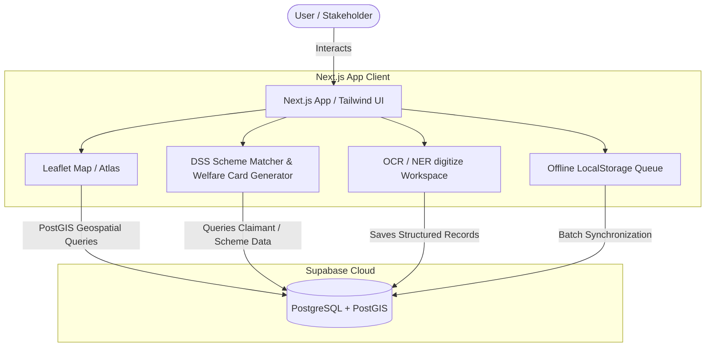

# TRINETRA — System Architecture

**Tribal Rights Intelligent Network for Empowerment through Technology, Research & Analysis**

TRINETRA is a research-backed, live prototype designed to digitize Forest Rights Act (FRA) claims, map spatial parcel boundaries, assess environmental and boundary disputes, and run a Decision Support System (DSS) matching titleholders with welfare schemes.

---

## 1. High-Level Architecture

The prototype is built as a unified web application utilizing **Next.js 14 (App Router)** deployed to Vercel, integrated with a **Supabase (PostgreSQL + PostGIS)** database.



---

## 2. Directory Structure

The project follows a standard Next.js App Router structure:

```
├── README.md               # Quick start & product summary
├── ROADMAP.md              # Day-by-day development milestones & scope boundaries
├── ARCHITECTURE.md         # Detailed technical design & system overview
├── package.json            # NPM dependencies & scripts
├── supabase/               # Database definitions & seeding configurations
│   ├── schema.sql          # Primary DDL tables, indices, and RLS policies
│   └── seed.sql            # Statistical synthetic seed dataset matching research
├── scripts/                # Utility scripts
│   └── generate-seed.js    # Node script to generate seed.sql with seeded random
└── src/
    ├── app/                # Next.js App Router pages (routing entry points)
    │   ├── page.tsx        # Landing Page (Problem, narrative, DOI citations, comparison widget)
    │   ├── atlas/          # FRA Atlas mapping interface
    │   ├── dashboard/      # Analytical statistics dashboard (Recharts)
    │   ├── digitize/       # OCR & NER digitization workspace
    │   ├── dss/            # Welfare convergence scheme matcher
    │   └── research/       # Scientific references & Chhattisgarh WebGIS benchmark page
    ├── components/         # Reusable React components grouped by module
    │   ├── atlas/          # Map markers, details panels, and custom Leaflet hooks
    │   ├── dashboard/      # Analytic chart containers
    │   ├── digitize/       # OCR upload, field confidence editors, local queue manager
    │   ├── dss/            # Selection cards & printable Welfare Convergence Card template
    │   └── layout/         # Header stakeholder simulator switcher (Community / Verifier / Admin)
    ├── data/               # Static local configuration & dictionary lists
    └── lib/                # Shared utilities & helpers
        ├── dss.ts          # Deterministic scheme eligibility evaluator
        ├── ner.ts          # Regex & heuristic Name Entity Recognition logic
        ├── offline-store.ts# LocalStorage offline submission queue synchronizer
        ├── queries.ts      # Client-side Supabase queries
        ├── role-store.ts   # State hook simulating user role persistence
        ├── stats.ts        # Aggregators for dashboard statistics
        └── supabase.ts     # Supabase client instance initializer
```

---

## 3. Database Schema

The relational database schema is stored in Supabase with PostGIS spatial indexing:

| Table Name | Description | Key Attributes / Relations |
| :--- | :--- | :--- |
| **`states`** | Contextual forest & tribal info for target states | `code` (PK), `name`, `forest_cover_pct`, `tribal_population_pct` |
| **`claimants`** | Claimant household demographic profile | `id` (PK), `full_name`, `state_code` (FK), `category` (`ST` / `OTFD`), `household_size` |
| **`claims`** | FRA Claim specifics (type, status, areas) | `id` (PK), `claimant_id` (FK), `claim_type` (`IFR`/`CR`/`CFR`), `status` (`approved`/`pending`/`rejected`), `digitized` |
| **`land_parcels`** | Geometic polygon and centroid map metadata | `id` (PK), `claim_id` (FK), `ulpin` (Unique Land Parcel ID), `geom` (Polygon geometry), `centroid` (Point geometry) |
| **`schemes`** | Welfare schemes metadata and rules | `code` (PK), `name`, `description`, `eligibility_json` |
| **`scheme_matches`**| Resolved DSS mapping results | `id` (PK), `claimant_id` (FK), `scheme_code` (FK), `eligible` (Boolean), `reason` |

---

## 4. Key Functional Modules

### A. FRA Atlas & Leaflet Integration (`/atlas`)
- **Interactive Map:** Displays claims mapped to their corresponding boundary polygon and status.
- **Layers Control:** Integrates overlapping GIS overlays:
  1. *Forest Canopy Loss (Pre-2005 / Post-2005)*
  2. *Protected Tiger Reserves / Wild Life Zones*
  3. *Admin Boundaries*
- **Spatial Dispute Engine:** Triggers PostGIS `ST_Intersects` checks client-side or during lookup to flag claims overlapping with protected forest boundaries or those showing canopy violations.

### B. Digitization Workspace (`/digitize`)
- **Multilingual OCR:** Utilizes client-side `Tesseract.js` to run OCR on English, Hindi, or Odia forest claims forms.
- **Heuristic NER:** Parses OCR text to extract claimant name, land area, claimed type, and ULPIN via `lib/ner.ts`.
- **Human-in-the-Loop Review:** Provides a side-by-side verification pane where users can override confident or uncertain fields prior to final submission.

### C. Decision Support System (DSS) & Convergence (`/dss`)
- **Scheme Rules Engine:** In `lib/dss.ts`, claimants are evaluated for welfare programs like *PM-JANMAN*, *MGNREGA*, *PM-KISAN*, and *Jal Jeevan Mission (JJM)*.
- **Welfare Convergence Card:** Once evaluated, a printable convergence packet is compiled. It generates recommended convergence actions, custom document checklists, and a CSS-styled barcode.

### D. Offline Synchronization Simulator
- **Toggle Offline Mode:** Simulates network isolation for remote tribal regions.
- **Queue Manager:** Queues new digitizations locally inside browser `localStorage`.
- **Batch Sync:** Once online connectivity is restored, syncs offline submissions back to Supabase.

### E. Stakeholder Simulation Switcher
- **Community:** Read-only viewing mode with disabled upload capabilities.
- **Verifier:** Visualizes verification actions (Approve/Reject panels) that dynamically alter claim statuses on the interactive map.
- **Administrator:** Grants access to the complete stats dashboard, analytical views, and batch welfare card generation.
